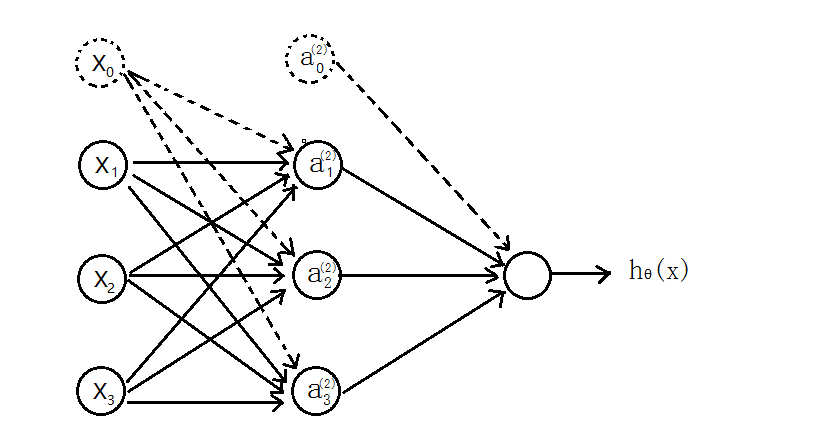
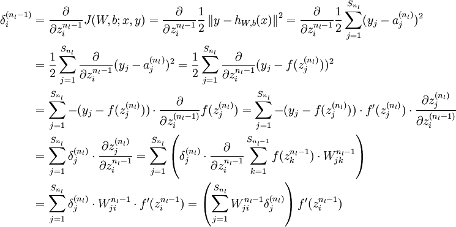
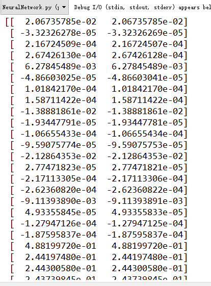
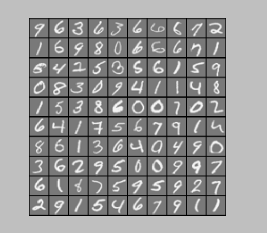
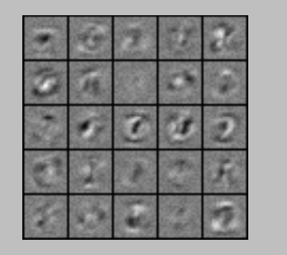

## 三、BP神经网络
- [全部代码](../../code/3-NeuralNetwok/NeuralNetwork.py)

### 1、神经网络model
- 先介绍个三层的神经网络，如下图所示
 - 输入层（input layer）有三个units（为补上的bias，通常设为`1`）
 - 表示第`j`层的第`i`个激励，也称为为单元unit
 - 为第`j`层到第`j+1`层映射的权重矩阵，就是每条边的权重


- 所以可以得到：
 - 隐含层：  
   
   

 - 输出层   
 其中，**S型函数**，也成为**激励函数**
- 可以看出 为3x4的矩阵，为1x4的矩阵
 -  ==》`j+1`的单元数x（`j`层的单元数+1）

### 2、代价函数
- 假设最后输出的，即代表输出层有K个单元
- ![J(\Theta ) =  - \frac{1}{m}\sum\limits_{i = 1}^m {\sum\limits_{k = 1}^K {[y_k^{(i)}\log {{({h_\Theta }({x^{(i)}}))}_k}} }  + (1 - y_k^{(i)})\log {(1 - {h_\Theta }({x^{(i)}}))_k}]](http://chart.apis.google.com/chart?cht=tx&chs=1x0&chf=bg,s,FFFFFF00&chco=000000&chl=J%28%5CTheta%20%29%20%3D%20%20-%20%5Cfrac%7B1%7D%7Bm%7D%5Csum%5Climits_%7Bi%20%3D%201%7D%5Em%20%7B%5Csum%5Climits_%7Bk%20%3D%201%7D%5EK%20%7B%5By_k%5E%7B%28i%29%7D%5Clog%20%7B%7B%28%7Bh_%5CTheta%20%7D%28%7Bx%5E%7B%28i%29%7D%7D%29%29%7D_k%7D%7D%20%7D%20%20%2B%20%281%20-%20y_k%5E%7B%28i%29%7D%29%5Clog%20%7B%281%20-%20%7Bh_%5CTheta%20%7D%28%7Bx%5E%7B%28i%29%7D%7D%29%29_k%7D%5D) 其中，代表第`i`个单元输出
- 与逻辑回归的代价函数![J(\theta ) =  - \frac{1}{m}\sum\limits_{i = 1}^m {[{y^{(i)}}\log ({h_\theta }({x^{(i)}}) + (1 - } {y^{(i)}})\log (1 - {h_\theta }({x^{(i)}})]](http://chart.apis.google.com/chart?cht=tx&chs=1x0&chf=bg,s,FFFFFF00&chco=000000&chl=J%28%5Ctheta%20%29%20%3D%20%20-%20%5Cfrac%7B1%7D%7Bm%7D%5Csum%5Climits_%7Bi%20%3D%201%7D%5Em%20%7B%5B%7By%5E%7B%28i%29%7D%7D%5Clog%20%28%7Bh_%5Ctheta%20%7D%28%7Bx%5E%7B%28i%29%7D%7D%29%20%2B%20%281%20-%20%7D%20%7By%5E%7B%28i%29%7D%7D%29%5Clog%20%281%20-%20%7Bh_%5Ctheta%20%7D%28%7Bx%5E%7B%28i%29%7D%7D%29%5D)差不多，就是累加上每个输出（共有K个输出）


### 3、正则化
- `L`-->所有层的个数
- -->第`l`层unit的个数
- 正则化后的**代价函数**为  

 - 共有`L-1`层，
 - 然后是累加对应每一层的theta矩阵，注意不包含加上偏置项对应的theta(0)
- 正则化后的代价函数实现代码：
```
# 代价函数
def nnCostFunction(nn_params,input_layer_size,hidden_layer_size,num_labels,X,y,Lambda):
    length = nn_params.shape[0] # theta的中长度
    # 还原theta1和theta2
    Theta1 = nn_params[0:hidden_layer_size*(input_layer_size+1)].reshape(hidden_layer_size,input_layer_size+1)
    Theta2 = nn_params[hidden_layer_size*(input_layer_size+1):length].reshape(num_labels,hidden_layer_size+1)
    
    # np.savetxt("Theta1.csv",Theta1,delimiter=',')
    
    m = X.shape[0]
    class_y = np.zeros((m,num_labels))      # 数据的y对应0-9，需要映射为0/1的关系
    # 映射y
    for i in range(num_labels):
        class_y[:,i] = np.int32(y==i).reshape(1,-1) # 注意reshape(1,-1)才可以赋值
     
    '''去掉theta1和theta2的第一列，因为正则化时从1开始'''    
    Theta1_colCount = Theta1.shape[1]    
    Theta1_x = Theta1[:,1:Theta1_colCount]
    Theta2_colCount = Theta2.shape[1]    
    Theta2_x = Theta2[:,1:Theta2_colCount]
    # 正则化向theta^2
    term = np.dot(np.transpose(np.vstack((Theta1_x.reshape(-1,1),Theta2_x.reshape(-1,1)))),np.vstack((Theta1_x.reshape(-1,1),Theta2_x.reshape(-1,1))))
    
    '''正向传播,每次需要补上一列1的偏置bias'''
    a1 = np.hstack((np.ones((m,1)),X))      
    z2 = np.dot(a1,np.transpose(Theta1))    
    a2 = sigmoid(z2)
    a2 = np.hstack((np.ones((m,1)),a2))
    z3 = np.dot(a2,np.transpose(Theta2))
    h  = sigmoid(z3)    
    '''代价'''    
    J = -(np.dot(np.transpose(class_y.reshape(-1,1)),np.log(h.reshape(-1,1)))+np.dot(np.transpose(1-class_y.reshape(-1,1)),np.log(1-h.reshape(-1,1)))-Lambda*term/2)/m   
    
    return np.ravel(J)
```

### 4、反向传播BP
- 上面正向传播可以计算得到`J(θ)`,使用梯度下降法还需要求它的梯度
- BP反向传播的目的就是求代价函数的梯度
- 假设4层的神经网络,记为-->`l`层第`j`个单元的误差
 - 《===》（向量化）
 - 
 - 
 - 没有，因为对于输入没有误差
- 因为S型函数的倒数为：，所以上面的和可以在前向传播中计算出来

- 反向传播计算梯度的过程为：
 - （是大写的）
 - for i=1-m:     
 -       
-正向传播计算（l=2,3,4...L）      
-反向计算、...；       
-          
-      
     

- 最后，即得到代价函数的梯度
- 实现代码：
```
# 梯度
def nnGradient(nn_params,input_layer_size,hidden_layer_size,num_labels,X,y,Lambda):
    length = nn_params.shape[0]
    Theta1 = nn_params[0:hidden_layer_size*(input_layer_size+1)].reshape(hidden_layer_size,input_layer_size+1)
    Theta2 = nn_params[hidden_layer_size*(input_layer_size+1):length].reshape(num_labels,hidden_layer_size+1)
    m = X.shape[0]
    class_y = np.zeros((m,num_labels))      # 数据的y对应0-9，需要映射为0/1的关系    
    # 映射y
    for i in range(num_labels):
        class_y[:,i] = np.int32(y==i).reshape(1,-1) # 注意reshape(1,-1)才可以赋值
     
    '''去掉theta1和theta2的第一列，因为正则化时从1开始'''
    Theta1_colCount = Theta1.shape[1]    
    Theta1_x = Theta1[:,1:Theta1_colCount]
    Theta2_colCount = Theta2.shape[1]    
    Theta2_x = Theta2[:,1:Theta2_colCount]
    
    Theta1_grad = np.zeros((Theta1.shape))  #第一层到第二层的权重
    Theta2_grad = np.zeros((Theta2.shape))  #第二层到第三层的权重
    
    Theta1[:,0] = 0;
    Theta2[:,0] = 0;
    '''正向传播，每次需要补上一列1的偏置bias'''
    a1 = np.hstack((np.ones((m,1)),X))
    z2 = np.dot(a1,np.transpose(Theta1))
    a2 = sigmoid(z2)
    a2 = np.hstack((np.ones((m,1)),a2))
    z3 = np.dot(a2,np.transpose(Theta2))
    h  = sigmoid(z3)
    
    '''反向传播，delta为误差，'''
    delta3 = np.zeros((m,num_labels))
    delta2 = np.zeros((m,hidden_layer_size))
    for i in range(m):
        delta3[i,:] = h[i,:]-class_y[i,:]
        Theta2_grad = Theta2_grad+np.dot(np.transpose(delta3[i,:].reshape(1,-1)),a2[i,:].reshape(1,-1))
        delta2[i,:] = np.dot(delta3[i,:].reshape(1,-1),Theta2_x)*sigmoidGradient(z2[i,:])
        Theta1_grad = Theta1_grad+np.dot(np.transpose(delta2[i,:].reshape(1,-1)),a1[i,:].reshape(1,-1))
    
    '''梯度'''
    grad = (np.vstack((Theta1_grad.reshape(-1,1),Theta2_grad.reshape(-1,1)))+Lambda*np.vstack((Theta1.reshape(-1,1),Theta2.reshape(-1,1))))/m
    return np.ravel(grad)
```

### 5、BP可以求梯度的原因
- 实际是利用了`链式求导`法则
- 因为下一层的单元利用上一层的单元作为输入进行计算
- 大体的推导过程如下，最终我们是想预测函数与已知的`y`非常接近，求均方差的梯度沿着此梯度方向可使代价函数最小化。可对照上面求梯度的过程。

- 求误差更详细的推导过程：


### 6、梯度检查
- 检查利用`BP`求的梯度是否正确
- 利用导数的定义验证：

- 求出来的数值梯度应该与BP求出的梯度非常接近
- 验证BP正确后就不需要再执行验证梯度的算法了
- 实现代码：
```
# 检验梯度是否计算正确
# 检验梯度是否计算正确
def checkGradient(Lambda = 0):
    '''构造一个小型的神经网络验证，因为数值法计算梯度很浪费时间，而且验证正确后之后就不再需要验证了'''
    input_layer_size = 3
    hidden_layer_size = 5
    num_labels = 3
    m = 5
    initial_Theta1 = debugInitializeWeights(input_layer_size,hidden_layer_size); 
    initial_Theta2 = debugInitializeWeights(hidden_layer_size,num_labels)
    X = debugInitializeWeights(input_layer_size-1,m)
    y = 1+np.transpose(np.mod(np.arange(1,m+1), num_labels))# 初始化y
    
    y = y.reshape(-1,1)
    nn_params = np.vstack((initial_Theta1.reshape(-1,1),initial_Theta2.reshape(-1,1)))  #展开theta 
    '''BP求出梯度'''
    grad = nnGradient(nn_params, input_layer_size, hidden_layer_size, 
                     num_labels, X, y, Lambda)  
    '''使用数值法计算梯度'''
    num_grad = np.zeros((nn_params.shape[0]))
    step = np.zeros((nn_params.shape[0]))
    e = 1e-4
    for i in range(nn_params.shape[0]):
        step[i] = e
        loss1 = nnCostFunction(nn_params-step.reshape(-1,1), input_layer_size, hidden_layer_size, 
                              num_labels, X, y, 
                              Lambda)
        loss2 = nnCostFunction(nn_params+step.reshape(-1,1), input_layer_size, hidden_layer_size, 
                              num_labels, X, y, 
                              Lambda)
        num_grad[i] = (loss2-loss1)/(2*e)
        step[i]=0
    # 显示两列比较
    res = np.hstack((num_grad.reshape(-1,1),grad.reshape(-1,1)))
    print res
```

### 7、权重的随机初始化
- 神经网络不能像逻辑回归那样初始化`theta`为`0`,因为若是每条边的权重都为0，每个神经元都是相同的输出，在反向传播中也会得到同样的梯度，最终只会预测一种结果。
- 所以应该初始化为接近0的数
- 实现代码
```
# 随机初始化权重theta
def randInitializeWeights(L_in,L_out):
    W = np.zeros((L_out,1+L_in))    # 对应theta的权重
    epsilon_init = (6.0/(L_out+L_in))**0.5
    W = np.random.rand(L_out,1+L_in)*2*epsilon_init-epsilon_init # np.random.rand(L_out,1+L_in)产生L_out*(1+L_in)大小的随机矩阵
    return W
```

### 8、预测
- 正向传播预测结果
- 实现代码
```
# 预测
def predict(Theta1,Theta2,X):
    m = X.shape[0]
    num_labels = Theta2.shape[0]
    #p = np.zeros((m,1))
    '''正向传播，预测结果'''
    X = np.hstack((np.ones((m,1)),X))
    h1 = sigmoid(np.dot(X,np.transpose(Theta1)))
    h1 = np.hstack((np.ones((m,1)),h1))
    h2 = sigmoid(np.dot(h1,np.transpose(Theta2)))
    
    '''
    返回h中每一行最大值所在的列号
    - np.max(h, axis=1)返回h中每一行的最大值（是某个数字的最大概率）
    - 最后where找到的最大概率所在的列号（列号即是对应的数字）
    '''
    #np.savetxt("h2.csv",h2,delimiter=',')
    p = np.array(np.where(h2[0,:] == np.max(h2, axis=1)[0]))  
    for i in np.arange(1, m):
        t = np.array(np.where(h2[i,:] == np.max(h2, axis=1)[i]))
        p = np.vstack((p,t))
    return p 
```

### 9、输出结果
- 梯度检查：     

- 随机显示100个手写数字     

- 显示theta1权重     

- 训练集预测准确度     

- 归一化后训练集预测准确度     


--------------------