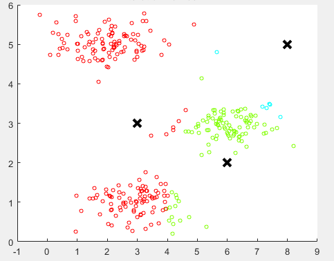

## 五、K-Means聚类算法
- [全部代码](../../code/5-K-Means/K-Means.py)

### 1、聚类过程
- 聚类属于无监督学习，不知道y的标记分为K类
- K-Means算法分为两个步骤
 - 第一步：簇分配，随机选`K`个点作为中心，计算到这`K`个点的距离，分为`K`个簇
 - 第二步：移动聚类中心：重新计算每个**簇**的中心，移动中心，重复以上步骤。
- 如下图所示：
 - 随机分配的聚类中心  
 
 - 重新计算聚类中心，移动一次  
 ![enter description here][35]
 - 最后`10`步之后的聚类中心  
 ![enter description here][36]

- 计算每条数据到哪个中心最近实现代码：
```
# 找到每条数据距离哪个类中心最近    
def findClosestCentroids(X,initial_centroids):
    m = X.shape[0]                  # 数据条数
    K = initial_centroids.shape[0]  # 类的总数
    dis = np.zeros((m,K))           # 存储计算每个点分别到K个类的距离
    idx = np.zeros((m,1))           # 要返回的每条数据属于哪个类
    
    '''计算每个点到每个类中心的距离'''
    for i in range(m):
        for j in range(K):
            dis[i,j] = np.dot((X[i,:]-initial_centroids[j,:]).reshape(1,-1),(X[i,:]-initial_centroids[j,:]).reshape(-1,1))
    
    '''返回dis每一行的最小值对应的列号，即为对应的类别
    - np.min(dis, axis=1)返回每一行的最小值
    - np.where(dis == np.min(dis, axis=1).reshape(-1,1)) 返回对应最小值的坐标
     - 注意：可能最小值对应的坐标有多个，where都会找出来，所以返回时返回前m个需要的即可（因为对于多个最小值，属于哪个类别都可以）
    '''  
    dummy,idx = np.where(dis == np.min(dis, axis=1).reshape(-1,1))
    return idx[0:dis.shape[0]]  # 注意截取一下
```
- 计算类中心实现代码：
```
# 计算类中心
def computerCentroids(X,idx,K):
    n = X.shape[1]
    centroids = np.zeros((K,n))
    for i in range(K):
        centroids[i,:] = np.mean(X[np.ravel(idx==i),:], axis=0).reshape(1,-1)   # 索引要是一维的,axis=0为每一列，idx==i一次找出属于哪一类的，然后计算均值
    return centroids
```

### 2、目标函数
- 也叫做**失真代价函数**
- 
- 最后我们想得到：  
![enter description here][37]
- 其中表示第`i`条数据距离哪个类中心最近，
- 其中即为聚类的中心

### 3、聚类中心的选择
- 随机初始化，从给定的数据中随机抽取K个作为聚类中心
- 随机一次的结果可能不好，可以随机多次，最后取使代价函数最小的作为中心
- 实现代码：(这里随机一次)
```
# 初始化类中心--随机取K个点作为聚类中心
def kMeansInitCentroids(X,K):
    m = X.shape[0]
    m_arr = np.arange(0,m)      # 生成0-m-1
    centroids = np.zeros((K,X.shape[1]))
    np.random.shuffle(m_arr)    # 打乱m_arr顺序    
    rand_indices = m_arr[:K]    # 取前K个
    centroids = X[rand_indices,:]
    return centroids
```

### 4、聚类个数K的选择
- 聚类是不知道y的label的，所以不知道真正的聚类个数
- 肘部法则（Elbow method）
 - 作代价函数`J`和`K`的图，若是出现一个拐点，如下图所示，`K`就取拐点处的值，下图此时`K=3`
 ![enter description here][38]
 - 若是很平滑就不明确，人为选择。
- 第二种就是人为观察选择

### 5、应用——图片压缩
- 将图片的像素分为若干类，然后用这个类代替原来的像素值
- 执行聚类的算法代码：
```
# 聚类算法
def runKMeans(X,initial_centroids,max_iters,plot_process):
    m,n = X.shape                   # 数据条数和维度
    K = initial_centroids.shape[0]  # 类数
    centroids = initial_centroids   # 记录当前类中心
    previous_centroids = centroids  # 记录上一次类中心
    idx = np.zeros((m,1))           # 每条数据属于哪个类
    
    for i in range(max_iters):      # 迭代次数
        print u'迭代计算次数：%d'%(i+1)
        idx = findClosestCentroids(X, centroids)
        if plot_process:    # 如果绘制图像
            plt = plotProcessKMeans(X,centroids,previous_centroids) # 画聚类中心的移动过程
            previous_centroids = centroids  # 重置
        centroids = computerCentroids(X, idx, K)    # 重新计算类中心
    if plot_process:    # 显示最终的绘制结果
        plt.show()
    return centroids,idx    # 返回聚类中心和数据属于哪个类
```

### 6、使用scikit-learn库中的线性模型实现聚类
- [全部代码](../../code/5-K-Means/K-Means_scikit-learn.py)

- 导入包
```
    from sklearn.cluster import KMeans
```
- 使用模型拟合数据
```
    model = KMeans(n_clusters=3).fit(X) # n_clusters指定3类，拟合数据
```
- 聚类中心
```
    centroids = model.cluster_centers_  # 聚类中心
```

### 7、运行结果
- 二维数据类中心的移动  
![enter description here][39]
- 图片压缩  
![enter description here][40]


----------------------

  [34]: ../../images/K-Means_01.png "K-Means_01.png"
  [35]: ../../images/K-Means_02.png "K-Means_02.png"
  [36]: ../../images/K-Means_03.png "K-Means_03.png"
  [37]: ../../images/K-Means_07.png "K-Means_07.png"
  [38]: ../../images/K-Means_04.png "K-Means_04.png"
  [39]: ../../images/K-Means_05.png "K-Means_05.png"
  [40]: ../../images/K-Means_06.png "K-Means_06.png"

